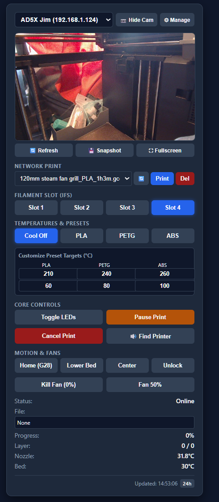

# Flashforge AD5X ESP32 Web Monitor \& Control Dashboard



A lightweight, highly responsive ESP32-based web dashboard designed for the **Flashforge Adventurer 5M (AD5X)** 3D printer. It provides real-time telemetry, direct network printing from an Unraid media server, Multi-Filament Station (IFS) slot management, motion controls, and thermal safety warnings directly in your web browser.

\---

## ✨ Features

* **Real-Time Telemetry**: Live status updates for print progress, current layer count, and active file names.
* **Thermal Safety Warnings**: Dynamic visual alerts (glowing red text and card borders) that trigger whenever the nozzle or bed temperature exceeds 50°C to indicate burn risks.
* **Temperature Presets \& Customizer**: Quick-action buttons for Cooldown, PLA, PETG, and ABS with active-state indicators and editable target values.
* **Filament Slot (IFS) Selection**: Seamless multi-material slot switching (Slots 1–4) with instant visual feedback.
* **Unraid Network Printing**: Browse, select, stream (`.gcode`), and delete files directly from an Unraid/Nginx server repository.
* **Core Controls \& Motion**:

  * Homing (`G28`), bed lowering, and head centering macros.
  * Part cooling fan and chamber filter fan toggles.
  * LED lighting toggles, print pause/resume/cancel, and printer locator beep (`M300`).
* **Live Camera Stream**: Embedded camera view with refresh, snapshot, and fullscreen capabilities.

\---

## 🛠️ Hardware \& Prerequisites

* **Microcontroller**: ESP32 Dev Board
* **Printer**: Flashforge Adventurer 5M / AD5X (communicating via TCP port 8899)
* **Server**: Unraid server running an Nginx container for G-code file storage and web streaming.

\---

## 🚀 Getting Started \& Installation

### 1\. Clone or Download the Repository

Download the project files (`.ino` and `config.example.h`) and open them in the **Arduino IDE**.

### 2\. Configure Your Network

1. Rename the file `config.example.h` to **`config.h`**.
2. Open `config.h` and update your local settings:

```cpp
   const char\* ssid = "YOUR\_WIFI\_SSID";
   const char\* password = "YOUR\_WIFI\_PASSWORD";
   
   // Set your static IP / network details
   const bool USE\_STATIC\_IP = true;
   IPAddress local\_IP(192, 168, 1, y);
   IPAddress gateway(192, 168, 1, z);
   
   // Set your Unraid server IP and printer IP
   const char\* UNRAID\_SERVER\_IP = "192.168.1.X";

